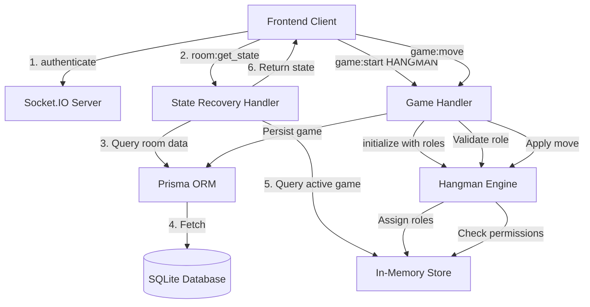
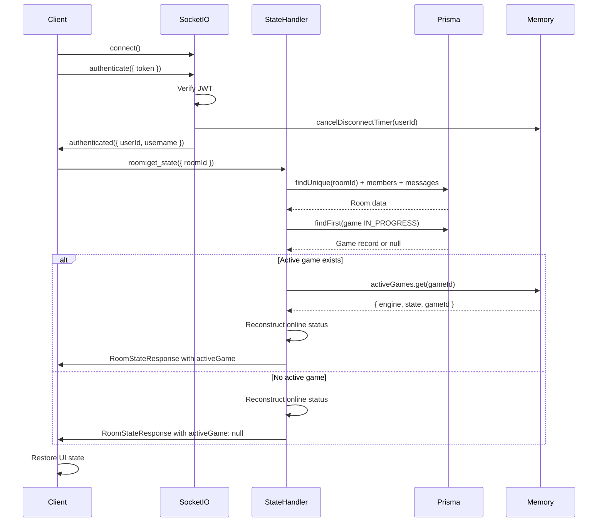
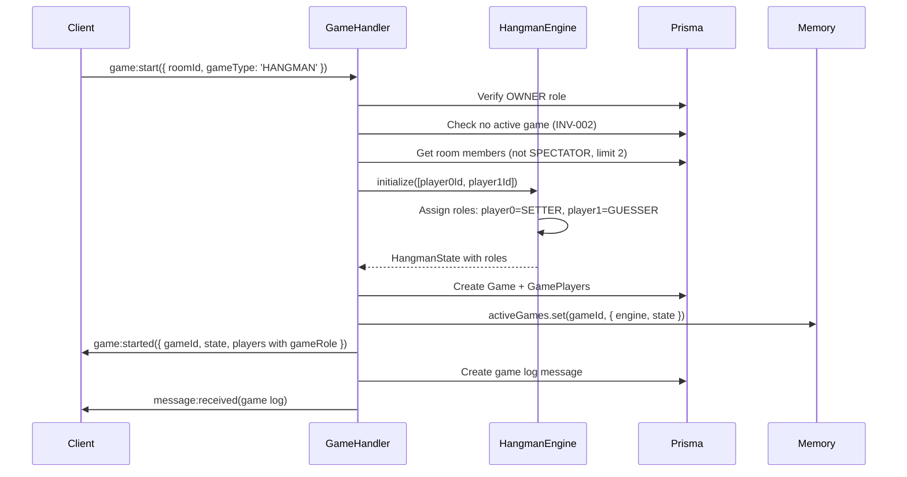
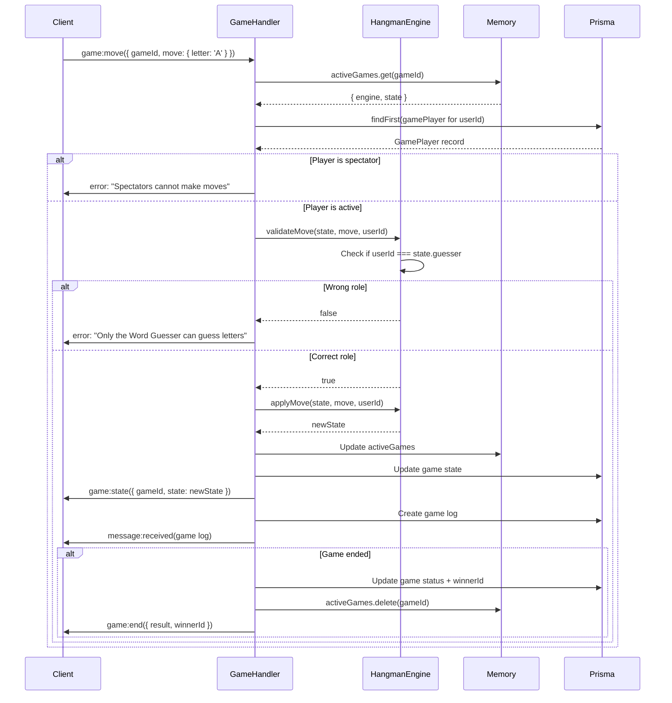

# Design Document: PlayChat Completion - Backend Implementation

## Overview

This design document specifies the backend implementation for Requirements 1 (State Recovery on Reconnection) and Requirement 2 (Hangman Role Assignment) of the PlayChat completion project. The backend uses Fastify v5 with Socket.IO v4 for real-time communication, Prisma ORM with SQLite for data persistence, and maintains an in-memory game state store for active games.

### Scope

**In Scope:**
- State recovery system architecture (socket event-based)
- State recovery data structures and API specifications
- Hangman role assignment logic (Word Setter vs Word Guesser)
- Hangman game engine modifications for role-based validation
- Backend socket event handlers for state recovery
- Backend game handler modifications for role enforcement
- Error handling strategies for state recovery failures
- Sequence diagrams for key flows

**Out of Scope:**
- Frontend implementation (separate design phase)
- Toast notification system (Requirement 3)
- Loading state management (Requirement 4)
- Mobile responsiveness (Requirement 5)
- Other requirements (6-8)

### Design Goals

1. **Seamless Reconnection**: Users should be able to refresh the page or reconnect and immediately resume their session without losing game state, chat history, or room membership
2. **Fair Role Assignment**: Hangman roles should be assigned deterministically and enforced consistently
3. **Maintain Invariants**: All existing system invariants (INV-001 through INV-010) must remain intact
4. **Backward Compatibility**: Existing games (TicTacToe, ConnectFour, RockPaperScissors) must continue to work without modification
5. **Performance**: State recovery should complete within 500ms for typical room sizes (2-10 members, <100 messages)

## Architecture

### High-Level Component Interaction



### State Recovery Architecture Decision

**Decision: Use Socket Event (`room:get_state`) instead of REST Endpoint**

**Rationale:**
1. **Consistency**: All real-time operations already use Socket.IO events (room:join, game:move, message:send)
2. **Authentication**: Socket authentication is already established before state recovery is needed
3. **Connection Reuse**: No need to establish a separate HTTP connection
4. **Error Handling**: Socket event callbacks provide consistent error handling pattern
5. **Simplicity**: Reduces the number of communication channels between frontend and backend

**Alternative Considered:**
- REST endpoint (GET /api/rooms/:id/state) was considered but rejected due to requiring separate authentication middleware and HTTP connection management

### Data Storage Strategy

**In-Memory Storage (activeGames Map):**
- Current game state for active games
- Game engine instances
- Player turn information
- Hangman role assignments (setter/guesser)

**Database Storage (Prisma/SQLite):**
- Room metadata and membership
- Chat message history (current session only, per INV-006)
- Game records (status, type, winner)
- GamePlayer records (role, playerIndex)
- User stats

**Rationale:**
- In-memory storage provides fast access for game logic validation
- Database storage provides persistence for reconnection scenarios
- Hybrid approach balances performance with reliability

## Components and Interfaces

### 1. State Recovery Handler

**Location:** `backend/src/socket/handlers/room.handler.ts`

**New Socket Event:**

```typescript
socket.on('room:get_state', async (
  data: { roomId: string }, 
  callback?: (res: RoomStateResponse | { error: string }) => void
) => {
  // Implementation details in pseudocode section
});
```

**Response Interface:**

```typescript
interface RoomStateResponse {
  room: {
    id: string;
    name: string;
    type: string;
    maxMembers: number;
  };
  members: Array<{
    userId: string;
    username: string;
    displayName: string;
    role: 'OWNER' | 'MEMBER' | 'SPECTATOR';
    isOnline: boolean;
  }>;
  messages: Array<{
    id: string;
    content: string;
    type: 'CHAT' | 'GAME_LOG';
    userId: string;
    username: string;
    displayName: string;
    createdAt: string;
  }>;
  activeGame: {
    gameId: string;
    gameType: string;
    status: string;
    state: GameState;
    players: Array<{
      userId: string;
      username: string;
      displayName: string;
      role: string;
      playerIndex: number;
    }>;
  } | null;
  userRole: 'OWNER' | 'MEMBER' | 'SPECTATOR';
}
```

### 2. Hangman Role Manager

**Location:** `backend/src/games/Hangman.ts`

**Modified State Interface:**

```typescript
interface HangmanState extends GameState {
  word: string;
  guessedLetters: string[];
  wrongCount: number;
  currentPlayerIndex: number;
  players: string[];
  winner: string | null;
  setter: string;      // NEW: Word Setter userId
  guesser: string;     // NEW: Word Guesser userId
  roles: {             // NEW: Explicit role mapping
    [userId: string]: 'SETTER' | 'GUESSER';
  };
}
```

**Role Assignment Strategy:**

**Decision: First-Join Deterministic Assignment**

- **Player 0 (first in players array)**: Word Setter
- **Player 1 (second in players array)**: Word Guesser

**Rationale:**
1. **Deterministic**: Same input always produces same output
2. **Simple**: No randomness to test or debug
3. **Fair**: Players alternate being first/second across multiple games
4. **Stateless**: No need to track previous game roles

**Alternative Considered:**
- Random assignment: Rejected due to non-determinism making testing harder
- Alternating based on previous games: Rejected due to requiring additional state tracking

### 3. Game Handler Modifications

**Location:** `backend/src/socket/handlers/game.handler.ts`

**Modified game:start Handler:**

```typescript
// When gameType === 'HANGMAN', include role information in response
io.to(roomId).emit('game:started', {
  gameId: game.id,
  gameType,
  state: gameState,
  players: game.players.map(p => ({
    ...p,
    gameRole: (gameState as HangmanState).roles[p.userId] // NEW
  })),
});
```

**Modified game:move Handler:**

```typescript
// Role validation now handled by Hangman engine's validateMove
// No changes needed to handler logic, but error messages will be more specific
```

## Data Models

### Database Schema (No Changes Required)

The existing Prisma schema already supports all required functionality:

```prisma
model GamePlayer {
  id          String @id @default(cuid())
  gameId      String
  userId      String
  role        String @default("PLAYER")  // Can store "SETTER" or "GUESSER" for Hangman
  playerIndex Int    @default(0)
  
  game        Game   @relation(fields: [gameId], references: [id], onDelete: Cascade)
  user        User   @relation(fields: [userId], references: [id])
  
  @@unique([gameId, userId])
}
```

**Note:** The `role` field in GamePlayer can be used to persist Hangman roles ("SETTER", "GUESSER") alongside the existing "PLAYER" and "SPECTATOR" roles. However, the primary source of truth for Hangman roles during active gameplay is the in-memory game state.

### In-Memory State Structure

**activeGames Map:**

```typescript
Map<gameId: string, {
  engine: GameEngine;
  state: GameState;  // For Hangman, this is HangmanState with roles
  gameId: string;
}>
```

**socketRoomMap (Existing):**

```typescript
Map<socketId: string, roomId: string>
```

**disconnectTimers (Existing):**

```typescript
Map<userId: string, NodeJS.Timeout>
```

## API Specifications

### Socket Events

#### 1. room:get_state (NEW)

**Direction:** Client → Server

**Request:**
```typescript
{
  roomId: string;
}
```

**Response (Success):**
```typescript
{
  room: RoomInfo;
  members: MemberInfo[];
  messages: MessageInfo[];
  activeGame: ActiveGameInfo | null;
  userRole: 'OWNER' | 'MEMBER' | 'SPECTATOR';
}
```

**Response (Error):**
```typescript
{
  error: string;  // "Room not found" | "Not a member" | "Failed to fetch state"
}
```

**Behavior:**
- Validates that the requesting user is a member of the room
- Fetches room data, members, and messages from database
- Fetches active game state from in-memory store if available
- Reconstructs member online status from active socket connections
- Returns complete room state or error

#### 2. game:started (MODIFIED)

**Direction:** Server → Client

**Payload (Enhanced for Hangman):**
```typescript
{
  gameId: string;
  gameType: string;
  state: GameState;  // For Hangman, includes setter/guesser/roles
  players: Array<{
    userId: string;
    username: string;
    displayName: string;
    role: string;
    playerIndex: number;
    gameRole?: 'SETTER' | 'GUESSER';  // NEW: Only for Hangman
  }>;
}
```

#### 3. game:move (MODIFIED ERROR RESPONSES)

**Direction:** Client → Server

**New Error Messages:**
- "Only the Word Setter can submit the word" (Hangman-specific)
- "Only the Word Guesser can guess letters" (Hangman-specific)
- "Not your turn" (existing, applies to other games)

## Sequence Diagrams

### State Recovery Flow



### Hangman Game Start with Role Assignment



### Hangman Move Validation with Role Checking



## Detailed Algorithms

### Algorithm 1: State Recovery Handler

```typescript
async function handleGetState(
  socket: Socket,
  data: { roomId: string },
  callback?: (res: RoomStateResponse | { error: string }) => void
) {
  const userId = socket.data.userId;
  const { roomId } = data;
  
  try {
    // Step 1: Verify membership
    const membership = await prisma.roomMember.findFirst({
      where: { userId, roomId }
    });
    
    if (!membership) {
      callback?.({ error: 'Not a member of this room' });
      return;
    }
    
    // Step 2: Fetch room data with members and messages
    const room = await prisma.room.findUnique({
      where: { id: roomId },
      include: {
        members: {
          include: {
            user: {
              select: {
                id: true,
                username: true,
                displayName: true
              }
            }
          }
        },
        messages: {
          orderBy: { createdAt: 'asc' },
          include: {
            user: {
              select: {
                id: true,
                username: true,
                displayName: true
              }
            }
          }
        }
      }
    });
    
    if (!room) {
      callback?.({ error: 'Room not found' });
      return;
    }
    
    // Step 3: Fetch active game from database
    const activeGameRecord = await prisma.game.findFirst({
      where: { roomId, status: 'IN_PROGRESS' },
      include: {
        players: {
          include: {
            user: {
              select: {
                id: true,
                username: true,
                displayName: true
              }
            }
          }
        }
      }
    });
    
    // Step 4: Fetch active game state from memory
    let activeGame: ActiveGameInfo | null = null;
    
    if (activeGameRecord) {
      const memoryGame = activeGames.get(activeGameRecord.id);
      
      if (memoryGame) {
        // Game is in memory - use current state
        activeGame = {
          gameId: activeGameRecord.id,
          gameType: activeGameRecord.gameType,
          status: activeGameRecord.status,
          state: memoryGame.state,
          players: activeGameRecord.players.map(p => ({
            userId: p.userId,
            username: p.user.username,
            displayName: p.user.displayName,
            role: p.role,
            playerIndex: p.playerIndex
          }))
        };
      } else {
        // Game exists in DB but not in memory - reconstruct from DB
        // This handles server restart scenarios
        const engine = gameEngines[activeGameRecord.gameType];
        if (engine) {
          const state = JSON.parse(activeGameRecord.state);
          activeGames.set(activeGameRecord.id, {
            engine,
            state,
            gameId: activeGameRecord.id
          });
          
          activeGame = {
            gameId: activeGameRecord.id,
            gameType: activeGameRecord.gameType,
            status: activeGameRecord.status,
            state,
            players: activeGameRecord.players.map(p => ({
              userId: p.userId,
              username: p.user.username,
              displayName: p.user.displayName,
              role: p.role,
              playerIndex: p.playerIndex
            }))
          };
        }
      }
    }
    
    // Step 5: Reconstruct online status from socket connections
    // Get all sockets in this room
    const socketsInRoom = await io.in(roomId).fetchSockets();
    const onlineUserIds = new Set(
      socketsInRoom.map(s => (s.data as { userId: string }).userId)
    );
    
    // Step 6: Build response
    const response: RoomStateResponse = {
      room: {
        id: room.id,
        name: room.name,
        type: room.type,
        maxMembers: room.maxMembers
      },
      members: room.members.map(m => ({
        userId: m.userId,
        username: m.user.username,
        displayName: m.user.displayName,
        role: m.role as 'OWNER' | 'MEMBER' | 'SPECTATOR',
        isOnline: onlineUserIds.has(m.userId)
      })),
      messages: room.messages.map(msg => ({
        id: msg.id,
        content: msg.content,
        type: msg.type as 'CHAT' | 'GAME_LOG',
        userId: msg.userId,
        username: msg.user.username,
        displayName: msg.user.displayName,
        createdAt: msg.createdAt.toISOString()
      })),
      activeGame,
      userRole: membership.role as 'OWNER' | 'MEMBER' | 'SPECTATOR'
    };
    
    callback?.(response);
    
  } catch (error) {
    console.error('State recovery error:', error);
    callback?.({ error: 'Failed to fetch room state' });
  }
}
```

### Algorithm 2: Hangman Role Assignment (in initialize)

```typescript
class Hangman extends GameEngine {
  initialize(players: string[]): HangmanState {
    if (players.length !== 2) {
      throw new Error('Hangman requires exactly 2 players');
    }
    
    // Deterministic role assignment: first player is setter, second is guesser
    const setter = players[0];
    const guesser = players[1];
    
    const word = WORD_LIST[Math.floor(Math.random() * WORD_LIST.length)];
    
    return {
      word,
      guessedLetters: [],
      wrongCount: 0,
      currentPlayerIndex: 1,  // Guesser goes first
      players: [...players],
      winner: null,
      setter,
      guesser,
      roles: {
        [setter]: 'SETTER',
        [guesser]: 'GUESSER'
      }
    };
  }
}
```

### Algorithm 3: Hangman Move Validation with Role Enforcement

```typescript
class Hangman extends GameEngine {
  validateMove(state: GameState, move: Move, userId: string): boolean {
    const s = state as HangmanState;
    const m = move as HangmanMove;
    
    // Game already ended
    if (s.winner) {
      return false;
    }
    
    // Check if move is a word guess
    if (m.word !== undefined) {
      // Only setter can submit word (for future word-setting feature)
      // Currently word is auto-generated, so reject word submissions
      return false;
    }
    
    // Check if move is a letter guess
    if (m.letter !== undefined) {
      // Only guesser can guess letters
      if (userId !== s.guesser) {
        return false;
      }
      
      const letter = m.letter.toUpperCase();
      
      // Validate letter format
      if (letter.length !== 1 || !/^[A-Z]$/.test(letter)) {
        return false;
      }
      
      // Check if letter already guessed
      if (s.guessedLetters.includes(letter)) {
        return false;
      }
      
      return true;
    }
    
    // No valid move type
    return false;
  }
}
```

## Error Handling

### State Recovery Errors

| Error Condition | Error Message | HTTP/Socket Status | Recovery Action |
|----------------|---------------|-------------------|-----------------|
| Room not found | "Room not found" | callback({ error }) | Redirect to dashboard |
| User not a member | "Not a member of this room" | callback({ error }) | Redirect to dashboard |
| Database query fails | "Failed to fetch room state" | callback({ error }) | Show error toast, retry button |
| Game state inconsistency | "Game state corrupted" | callback({ error }) | End game, notify users |
| Socket not authenticated | "Authentication required" | socket.emit('error') | Redirect to login |

### Hangman Role Errors

| Error Condition | Error Message | Socket Status | User Impact |
|----------------|---------------|---------------|-------------|
| Wrong role for letter guess | "Only the Word Guesser can guess letters" | callback({ error }) | Show error toast |
| Wrong role for word submission | "Only the Word Setter can submit the word" | callback({ error }) | Show error toast |
| Invalid letter format | "Invalid move" | callback({ error }) | Show error toast |
| Letter already guessed | "Invalid move" | callback({ error }) | Show error toast |
| Game already ended | "Invalid move" | callback({ error }) | Disable input |

### Error Handling Strategy

1. **Validation Errors**: Return immediately with descriptive error message via callback
2. **Database Errors**: Log error, return generic message to client, consider retry logic
3. **State Inconsistency**: Log error, attempt recovery (reconstruct from DB), or end game gracefully
4. **Authentication Errors**: Emit error event, disconnect socket, redirect to login

## Testing Strategy

### Unit Tests

**State Recovery Handler:**
- ✓ Returns complete state for valid room member
- ✓ Returns error for non-member
- ✓ Returns error for non-existent room
- ✓ Correctly reconstructs online status from socket connections
- ✓ Handles missing active game (returns null)
- ✓ Handles active game in memory
- ✓ Handles active game in DB but not memory (server restart scenario)

**Hangman Role Assignment:**
- ✓ Assigns player 0 as SETTER
- ✓ Assigns player 1 as GUESSER
- ✓ Throws error if not exactly 2 players
- ✓ Roles are included in returned state

**Hangman Move Validation:**
- ✓ Guesser can guess valid letters
- ✓ Guesser cannot guess already-guessed letters
- ✓ Guesser cannot guess invalid characters
- ✓ Setter cannot guess letters
- ✓ Neither player can move after game ends
- ✓ Validates letter format (single uppercase A-Z)

### Integration Tests

**State Recovery Flow:**
- ✓ User joins room, game starts, user disconnects, user reconnects, state is restored
- ✓ User joins room, sends messages, user disconnects, user reconnects, messages are restored
- ✓ User joins room as spectator, game in progress, user disconnects, user reconnects, spectator status maintained

**Hangman Game Flow:**
- ✓ Two users join room, owner starts Hangman, roles are assigned and broadcast
- ✓ Guesser guesses correct letter, state updates, all users notified
- ✓ Guesser guesses wrong letter, wrong count increments, all users notified
- ✓ Guesser guesses all letters, game ends with guesser win
- ✓ Guesser reaches max wrong guesses, game ends with setter win
- ✓ Setter attempts to guess letter, error returned
- ✓ Spectator attempts to guess letter, error returned

### Property-Based Tests

This feature is **NOT suitable for property-based testing** because:

1. **State Recovery** is an integration test scenario involving external services (database, socket connections) with high cost for repeated execution
2. **Hangman Role Assignment** is a deterministic configuration with no meaningful input variation (always 2 players)
3. **Role Validation** is a simple permission check with limited input space (2 roles × 2 move types)

**Testing Approach:**
- Use **example-based unit tests** for role validation logic
- Use **integration tests** with 2-3 scenarios for state recovery
- Use **end-to-end tests** for full user flows

### Manual Testing Checklist

- [ ] User refreshes page during active Hangman game, state is restored
- [ ] User disconnects and reconnects within 30 seconds, game continues
- [ ] User disconnects for >30 seconds, game ends, reconnection shows ended game
- [ ] Guesser can guess letters, Setter cannot
- [ ] Roles are displayed correctly in frontend
- [ ] Chat history is restored on reconnection
- [ ] Member list shows correct online/offline status
- [ ] Spectator cannot make moves in Hangman
- [ ] Multiple games can be played in sequence with roles maintained

## Implementation Notes

### Backward Compatibility

**Existing Games (TicTacToe, ConnectFour, RockPaperScissors):**
- No changes required to game engines
- State recovery works automatically (state is already in activeGames map)
- No role-specific validation needed

**Hangman:**
- Existing Hangman.ts already has `setter` and `guesser` fields
- Need to add `roles` map for explicit role tracking
- Need to modify `validateMove` to check `userId === state.guesser`

### Performance Considerations

**State Recovery:**
- Database query includes room + members + messages in single query (Prisma include)
- Messages are ordered by createdAt (indexed column)
- Online status reconstruction uses Socket.IO's built-in room membership (O(n) where n = room members)
- Expected response time: <200ms for typical room (2-10 members, <100 messages)

**Hangman Role Validation:**
- Role check is O(1) lookup in state object
- No database queries during move validation
- No performance impact compared to existing games

### Security Considerations

**State Recovery:**
- Verify user is a member before returning state (prevents unauthorized access)
- Do not expose game state to non-members
- Sanitize error messages (don't leak internal state)

**Hangman Roles:**
- Validate role on server side (never trust client)
- Role assignment is deterministic and cannot be manipulated
- Spectators are blocked at GamePlayer level (existing INV-005)

### Deployment Considerations

**Database Migrations:**
- No schema changes required
- Existing GamePlayer.role field can store "SETTER"/"GUESSER" if needed for analytics

**In-Memory State:**
- State recovery handles server restart by reconstructing activeGames from database
- Disconnect timers are lost on server restart (acceptable for demo)

**Monitoring:**
- Log state recovery requests and response times
- Log role validation failures (may indicate client bug or attack)
- Monitor activeGames map size (memory leak detection)

## Open Questions

1. **Should we persist Hangman roles to GamePlayer.role in the database?**
   - **Recommendation**: Yes, for analytics and debugging, but in-memory state remains source of truth during gameplay

2. **Should state recovery automatically rejoin the socket room?**
   - **Recommendation**: No, require explicit room:join after state recovery to maintain INV-001 (user in one room at a time)

3. **What happens if state recovery is called for a room the user is not in?**
   - **Recommendation**: Return error "Not a member of this room"

4. **Should we support word-setting by the Setter in future?**
   - **Recommendation**: Out of scope for this phase, but architecture supports it (validateMove already checks for word submission)

## Appendix

### Glossary

- **State Recovery**: The process of restoring a user's room state (game, chat, members) after reconnection
- **Role Assignment**: The process of assigning Word Setter and Word Guesser roles in Hangman
- **activeGames Map**: In-memory store of active game states keyed by gameId
- **socketRoomMap**: In-memory store mapping socket IDs to room IDs
- **GamePlayer**: Database record linking a user to a game with role and playerIndex

### References

- Fastify Documentation: https://fastify.dev/
- Socket.IO Documentation: https://socket.io/docs/v4/
- Prisma Documentation: https://www.prisma.io/docs/
- PlayChat Requirements Document: `.kiro/specs/playchat-completion/requirements.md`
- Existing Game Engine Pattern: `backend/src/games/GameEngine.ts`

